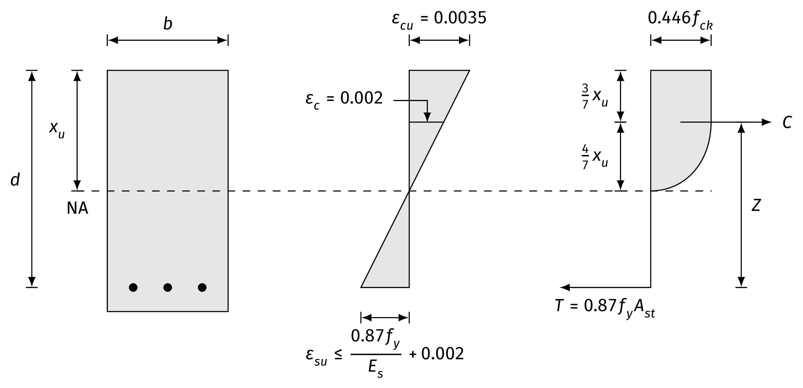

# Depth of neutral axis

Beams are assumed to fail in bending when the strain in concrete reaches limiting compression strain of $\varepsilon_{cu} = 0.0035$. But in all cases of design tensile strain in steel need not be equal to limiting strain given by $E_{su} = 0.002 + \frac{0.87f_y}{E_s}$, it can be less or more than it. However, designs with $\varepsilon_s < \varepsilon_{su}$ (over reinforced sections) are to be avoided.

Hence, for all cases,
$$
\begin{aligned}
\text{Total compressive force } (C) &= 0.36 f_{ck}b x_u \\
\text{Total tensile force } (T) &= f_s A_{st}
\end{aligned}
$$
$f_s$ is the stress in steel corresponding to $\varepsilon_{cu}$. Max value for $f_s = 0.87f_y$

Equilibrium requirement in horizontal direction gives,
$$
\begin{aligned}
C &= T &\\
0.36 f_{ck} b x_{u} &= f_s A_{st} &\\
x_u &= \frac{f_s A_{st}}{0.36 f_{ck} b} &\\
\frac{x_u}{d} &= \frac{f_s A_{st}}{0.36 f_{ck} b d} & \quad(A)
\end{aligned}
$$

::: note
For over reinforced section, use *Strain compatibility method*. Determine strain in steel ($\varepsilon_{st}$) using the expression,
$$
\varepsilon_{st}=0.0035 \left( \frac{d}{x_u} - 1 \right)
$$
From **IS 456:2000, SP-16 Table ‘A’**, find $f_{st}$ corresponding to $\varepsilon_{st}$. Finally find $x_u$ from expression ($A$).
:::

# Limiting depth of neutral axis

For balanced section, using similar triangle for strain diagram from Fig. 1,
$$
\begin{aligned}
\frac{\varepsilon_s}{d - x_u} &= \frac{\varepsilon_{cu}}{x_u} \\
\frac{\varepsilon_s}{d - x_u} &= \frac{0.0035}{x_u} \\
\frac{x_u}{d} &= \frac{0.0035}{\varepsilon_s + 0.0035}
\end{aligned}
$$
Again, we have, IS 456:2000, recommend that to avoid compression failure, minimum strain corresponding to $0.0035$ strain in steel as,
$$
\begin{aligned}
\varepsilon_{s, min} &= 0.87\frac{f_y}{E_s} + 0.002
\end{aligned}
$$
Then, limiting value of $x_u$ is given by,
$$
\begin{aligned}
\frac{x_{u, lim}}{d} &= \frac{0.0035}{0.87\frac{f_y}{E_s} + 0.002 + 0.0035} \\
\therefore \frac{x_{u, lim}}{d} &= \frac{0.0035}{0.87\frac{f_y}{E_s} + 0.0055}
\end{aligned}
$$

Where, $E_s$ = Young's modulus of steel = $2 \times 10^5 N/mm^2$

| Steel               | $f_y$ ($\mathrm{N/mm^2}$) | $\frac{x_{u, max}}{d}$ |
|:------------------- | -------------------------:| ----------------------:|
| Mild steel (Fe 250) |                       250 |                   0.53 |
| TOR steel (Fe 415)  |                       415 |                   0.48 |
| TMT (Fe 500)        |                       500 |                   0.46 |

Table: Limiting depth ratio values for different steels.

# Analysis of singly reinforced rectangular beams

As, we have from Fig. 1, above shown, the compressive force ($C$) in concrete and Tensile force ($T$) in steel are equal and opposite and are separated by distance ($d - 0.42 x_u$), which is called *lever arm* ($Z$). Hence, they form a couple. The couple moment is the moment of resistance and it is called moment carrying capacity when $\varepsilon = 0.0035$.

Thus, moment carrying capacity is given by:
$$
\begin{aligned}
M_u &= C\times \text{lever arm}(Z) &\\
&= 0.36 f_{ck} b x_u (d - 0.42 x_u) & \\
\therefore M_u &= 0.36 f_{ck} b x_u (d - 0.42 x_u) & \quad(B)
\end{aligned}
$$
As, we know, that limiting values of depth of neutral axis is known so by using the limiting values of depth of neutral axis for different, grades of steel, wer can derive the limiting moment carrying capacity for different grade of steels.

**For mild steel (Fe 250)**

From Clause 38.1 of code IS 456:2000,
$$
\begin{aligned}
\frac{x_{u, max}}{d} &= 0.53 \\
x_{u, max} &= 0.53d
\end{aligned}
$$
From expression ($B$),
$$
\begin{aligned}
M_{u, max} &= 0.36 \times f_{ck} \times b \times 0.53d (d - 0.42 \times 0.53d)\\ 
\therefore M_{u, max} &= 0.148 f_{ck} b d^2
\end{aligned}
$$

**For TOR steel (Fe 425)**
$$
M_{u, max} = 0.138 f_{ck} b d^2
$$

**For TMT steel (Fe 500)**
$$
M_{u, max} = 0.133 f_{ck} b d^2
$$

## Approximate expression for moment of resistance

In case of under reinforced or balanced sections, where $x_u \le x_{u, lim}$, the stress in steel reaches the limiting value of $0.87f_y$ earlier. Hence, the equilibrium equation for horizontal forces gives,
$$
\begin{aligned}
C &= T \\
0.36 f_{ck} b x_u &= 0.87 f_y A_{st} \\
x_u &= \frac{0.87 f_y A_{st}}{0.36 f_{ck} b}
\end{aligned}
$$
From moment equilibrium equations,
$$
\begin{aligned}
M_u &= T \times Z \\
&= 0.87 f_y A_{st} (d - 0.42 x_u) \\
&= 0.87 f_y A_{st} \left[d - 0.42 \times \frac{0.87 f_y A_{st}}{0.36 f_{ck} b}\right] \\
M_u &= 0.87 f_y A_{st} \left[d - 1.015 \frac{A_{st} f_y}{b f_{ck}}\right]
\end{aligned}
$$
Also, IS 456:2000, permits the approximation of the above expression,
$$
M_u = 0.87 f_y A_{st} \left[d - \frac{A_{st} f_y}{b f_{ck}}\right] \quad(C)
$$
In case of over reinforced sections, where $x_u > x_{u, lim}$, the actual moment of resistance of the section may be found with usual formula $C \times Z$ or $T \times Z$. However, to avoid compression failure, the strength of such section is to be considered as that of balance sections only i.e.,
$$
M_u = M_{u, lim} = 0.36 f_{ck} b x_{u, max} (d - 0.42 x_{u, max}) \quad(D)
$$

## Summary

Steps for the analysis of singly reinforced rectangular beams are as follows:

1. Calculate area of reinforcement steel, $A_{st}$,
2. Calculate depth of neutral axis ($x_u$) by using *Horizontal equilibrium*. i.e. by using the expression.
$$\begin{aligned}
C &= T \\
\text{or, } 0.36 f_{ck} b x_u &= f_s A_{st} \\
x_u &= \frac{f_s A_{st}}{0.36 f_{ck} b}
\end{aligned}$$
3. Calculate the limiting value of depth of neutral axis ($x_{u, lim}$) by using clause 38.1 of code IS 456:2000,
4. Compare $x_u$ with $x_{u, max}$ and determine whether the section is balanced section, under reinforced section or over reinforced section,
5. Find moment of resistance ($M_u$) by using the expression ($C$) for balanced and under reinforced section and expression ($D$) for over reinforced section.